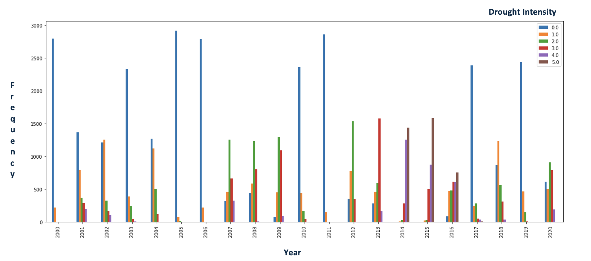
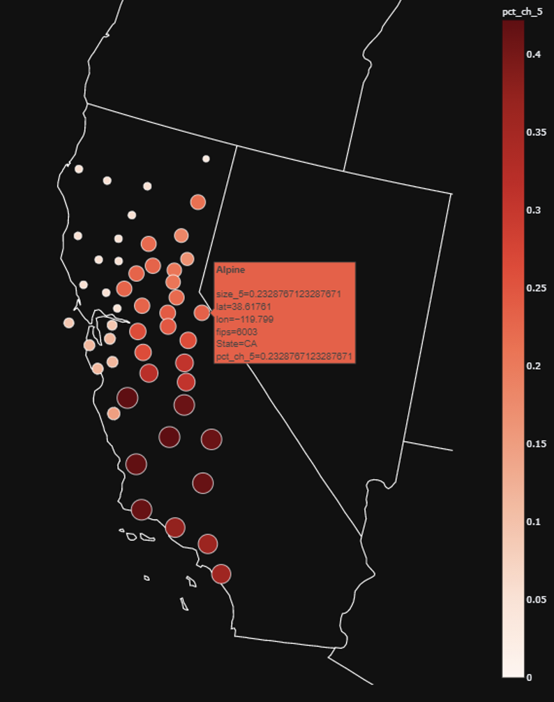
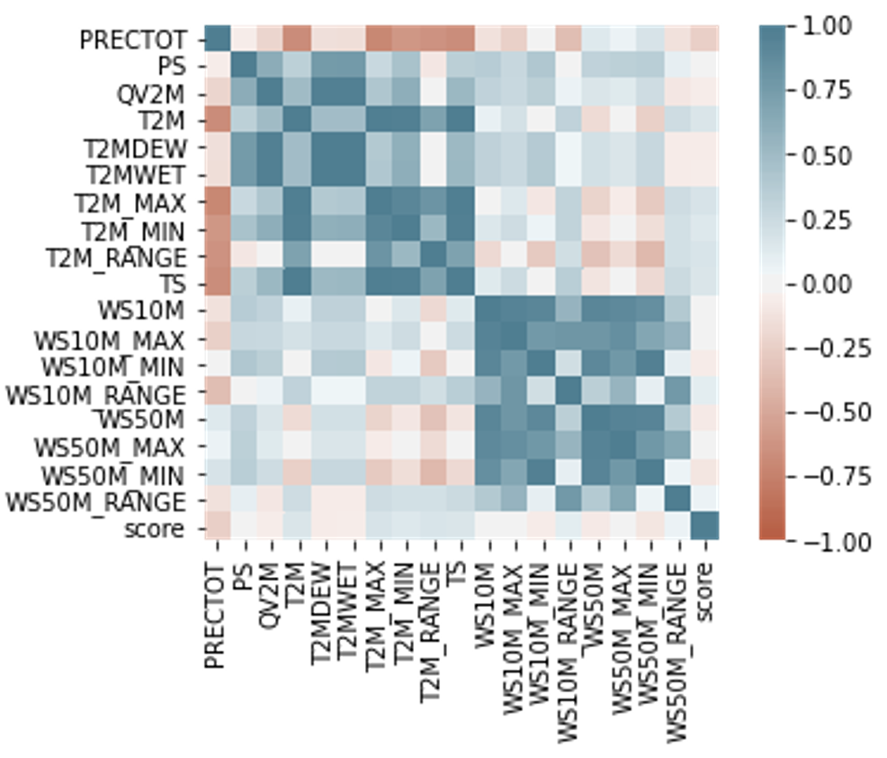

# California Drought Analysis & Prediction

Analysis and prediction of drought conditions across California's 58 counties using NASA meteorological data (2000–2020) and machine learning.

California has experienced increasingly severe and prolonged drought over the past two decades, with significant consequences for agriculture, water supply, and ecosystems. Accurately predicting drought conditions at the county level is challenging because drought is the result of complex interactions between precipitation deficits, temperature extremes, and soil-atmospheric dynamics. This project addresses that challenge by building a classification system that predicts drought intensity — measured by the Palmer Drought Severity Index (PDSI, scored 0–5) — from routine meteorological observations, enabling earlier and more granular drought detection across the state.

The dataset spans 21 years (2000–2020) of daily NASA POWER meteorological readings for all 58 California counties, yielding ~445,000 daily records with 18 features covering precipitation, surface pressure, humidity, temperatures, and wind speeds at 10 m and 50 m heights. Exploratory analysis revealed that PDSI labels are recorded weekly (not daily), making only ~63,500 records labeled. Precipitation (PRECTOT) showed the strongest negative correlation with drought score, while temperature features (T2M, T2M_MAX, TS) were positively correlated. Geographic analysis highlighted that southern and central valley counties consistently experienced the highest frequency of extreme drought (PDSI = 5) over the study period.

To bridge the gap between daily meteorological readings and weekly drought labels, each labeled observation was paired with the 90-day rolling average of all 18 features up to that date — capturing the cumulative nature of drought rather than any single day's conditions. Features were normalized using Min-Max scaling before model training. Five algorithms were evaluated on a binary drought/no-drought classification task: ANN, SVM (RBF kernel), Logistic Regression, XGBoost, and KNN, along with voting and stacking ensembles. KNN achieved the best standalone accuracy (~81%), and ensemble methods were explored to further improve robustness.

---

## Notebooks

| Notebook | Purpose |
|---|---|
| `dataset_manipulations.ipynb` | Load NASA train/validation/test data, filter to California counties |
| `A3.ipynb` | EDA, 90-day rolling aggregation, feature correlation analysis |
| `geo_map.ipynb` / `geo_map_2.ipynb` | Geographic visualization of drought intensity by county |
| `90_days_data_drought_or_not_different_algorithms.ipynb` | Compare ANN, SVM, Logistic Regression, XGBoost, KNN |
| `90_days_data_drought_or_not_voting_ensemble.ipynb` | Voting ensemble (KNN + XGBoost + SVM) |
| `90_days_data_drought_or_not_stacking_ensemble.ipynb` | Stacking ensemble experiments |
| `Final_model_training_results.ipynb` | Consolidated final results |

All notebooks run on **Google Colab**.

---

## Key Visuals

**Drought intensity distribution per year (2000–2020)**

**Drought intensity level 5 trend across California counties**

**Correlation matrix — meteorological features vs. drought intensity**

---

## Approach

- **Target**: PDSI drought score (0 = no drought → 5 = exceptional drought), labeled weekly
- **Features**: 18 NASA meteorological variables (precipitation, pressure, temperature, wind speed) aggregated over a 90-day rolling window per county
- **Best model**: KNN achieved ~81% accuracy on the binary drought/no-drought classification task

---

## Supporting Material

- `readme_material/DATA_601_FINAL_PAPER_draft.docx` — Project paper
- `readme_material/final_presentation.pptx` — Final presentation slides
